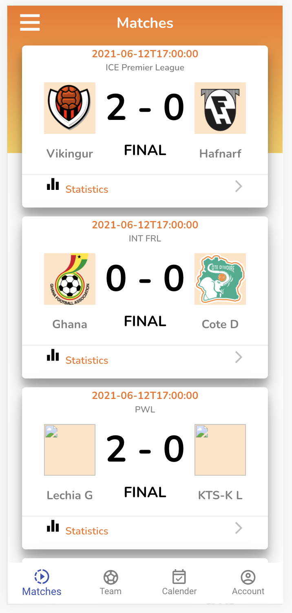

<h1 align="center">Live Score Apps</h1>

## Project Description

styling with css. using "Styled Component- React"

fetching data API with Axios

## Links

- [Repo](https://github.com/AndryanaBaros/livescore-apps)

- [Live](https://stackblitz.com/edit/technical-testt-andriana?file=src%2Fstyle.css)

- [API](https://client.elevenscore.com/swagger/index.html )

## Screenshots

## Built With

- React-JS
- JavaScript
- Node
- NPM
- HTML
- CSS

## Author

**Andryana Baros**

- [Profile](https://github.com/andryanabaros "Andryana Baros")
- [Email](mailto:andry.baros@gmail.com?subject=Hi "Hi!")

Give a ⭐️ if you like this project!
